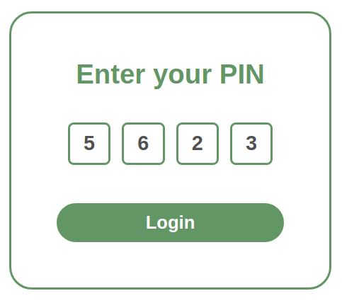

# Pin Code Input React Component



## Tech
- React
- Styled-Components

## How it Works

Implementing this component with multiple `<input />` elements would be problematic:
- the cursor would be flashing
- when the user presses the second character, focus would need to shift to the next `<input />`
- when the user presses backspace, focus would need to shift to the previous `<input />`
- if the user inputs 4 numbers, then presses on the first, focus would need to move accordingly
- ...and other problems

As such, a single `<input />` element which takes all the keyboard input is hidden, and four components show the user's input.

The `onChange` event is bypassed because it is easier to implement the desired features by capturing events from `onKeyDown`. 
```
onChange={() => null}
```
